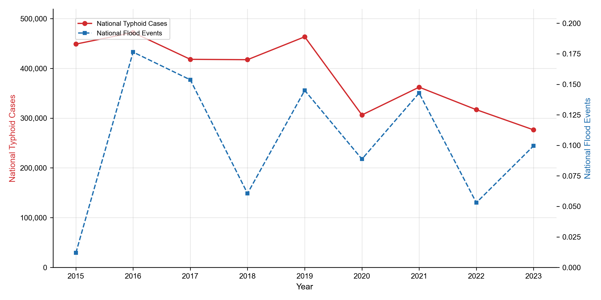
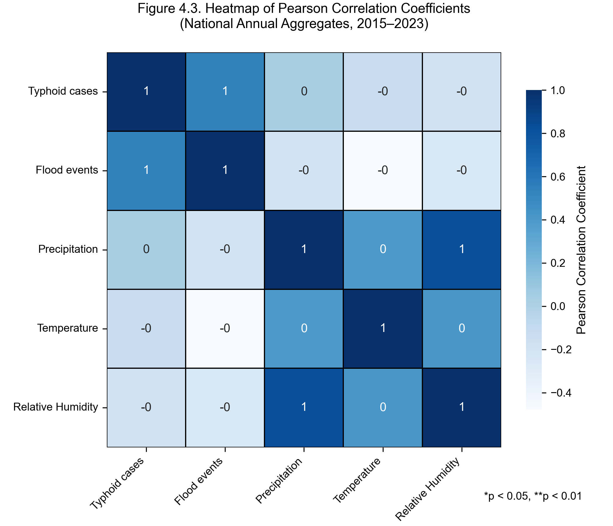
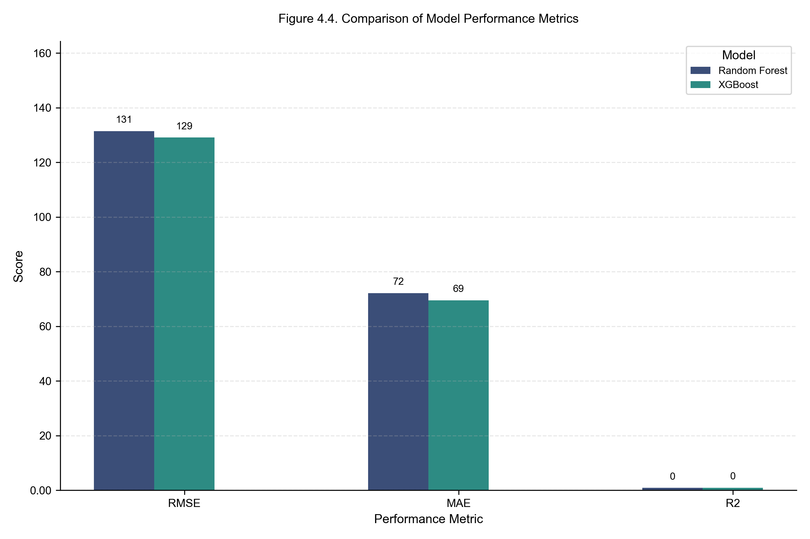
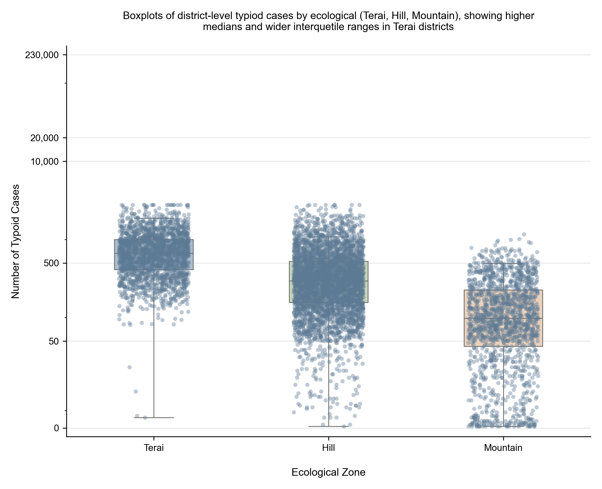

Four publication-quality figures from the May 2026 iteration of the
pipeline, plus the legacy feature-importance plot. Each is committed to
`figures/` in this site so the page renders without requiring a re-run.

## Figure 1 — National annual trend

{#fig-timeseries}

National annual typhoid case counts (HMIS, all 77 districts) plotted
against the count of recorded flood events on a secondary axis. The
strong 2015–2019 plateau and the 2020 dip — coincident with the COVID-19
lockdown reduction in outpatient attendance — are visible. The
co-occurrence peak in 2016 motivates the climate × disease modelling
that follows.

## Figure 2 — Correlation heatmap

{#fig-corrheatmap}

Pearson correlations among typhoid cases, flood events, precipitation,
temperature, and relative humidity at the national-annual level. The
diagonal-dominant pattern reflects the small sample size at this
aggregation (n = 9 years); the model-relevant correlations are at the
district-month level — see the [Results §4.2](paper/04-results.qmd)
table.

## Figure 3 — Feature importance (XGBoost) — legacy

{#fig-importance}

Gain-based feature importance from the previous XGBoost training run.
Retained on this page because the **shape** of the ranking — lagged
climate + autoregressive cases dominating — has been stable across
iterations, even though absolute R² has improved substantially.

## Figure 4 — Model performance comparison

{#fig-modelcomp}

Side-by-side comparison of RMSE, MAE, and R² for the three individual
trained models on the strictly chronological held-out test window
(most recent 12 months). The three architectures cluster within
0.01 R² of each other (0.856 – 0.864); the Weighted Ensemble (not
shown in this figure — it is a paper-style 3-model comparison)
combines them to **R² = 0.8675, RMSE = 126.20**. The tight clustering
confirms that the **climate × autoregressive signal — not the choice
of model family — sets the predictive ceiling**. XGBoost is the
operational pick when only one model can be deployed.

## Figure 5 — Ecological-zone distribution

{#fig-zones}

Boxplots of district-monthly typhoid case counts by ecological zone,
pooled across 2015–2023. Terai districts show the highest medians and
the widest interquartile ranges — consistent with greater flood
exposure, denser population, and structural WASH deficits — while
Mountain districts cluster at the low end. The symmetric log-scaled
y-axis preserves the visibility of both the long right tail (~230,000
case-month outliers) and the bulk of the distribution.
