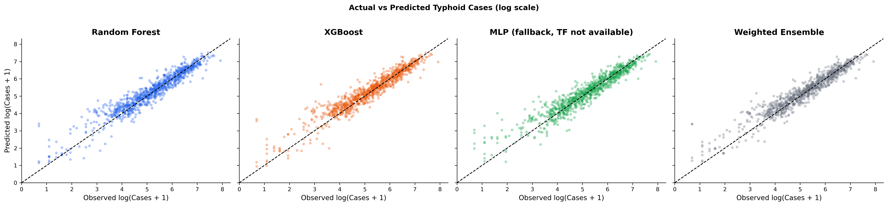

# {.title-slide}

::: {style="margin-top: 1.5em;"}
:::

::: {style="font-family: var(--serif); font-style: italic; font-size: 0.6em; letter-spacing: 0.15em; text-transform: uppercase; color: var(--ink-mute); margin-bottom: 0.5em;"}
Research Presentation
:::

::: {style="font-family: var(--serif); font-weight: 500; font-size: 1.7em; color: var(--ink); line-height: 1.1; letter-spacing: -0.02em; margin-bottom: 0.3em;"}
Predictive Modeling of Typhoid Incidence in Nepal
:::

::: {style="font-family: var(--serif); font-style: italic; font-size: 1em; color: var(--ink-soft); margin-bottom: 1.8em;"}
Under Extreme Climate Change Scenarios Using Machine Learning
:::

::: {style="width: 80px; height: 1px; background: var(--accent-gold); margin-bottom: 1.5em;"}
:::

::: {style="font-family: var(--sans); font-size: 0.7em; font-weight: 500; letter-spacing: 0.06em; text-transform: uppercase; color: var(--ink);"}
Kritika Baral
:::

::: {style="font-family: var(--serif); font-style: italic; font-size: 0.7em; color: var(--ink-soft); margin-top: 0.2em;"}
Kathmandu University · Department of Health Informatics · Dhulikhel, Nepal
ORCID 0009-0007-1517-1063
:::

::: {style="margin-top: 2.5em; display: flex; gap: 0.8em; justify-content: flex-start; flex-wrap: wrap;"}
[Download PDF](presentation.html?print-pdf){.btn target="_blank" rel="noopener"}
[Download PPTX](presentation.pptx){.btn}
:::

::: {.notes}
Good morning. My name is Kritika Baral. Today I'll present my research on predictive modeling of typhoid incidence in Nepal under climate change scenarios — work that integrates three independent national datasets across all 77 districts over nine years to ask whether climate-induced floods can predict typhoid burden months in advance.
:::

---

## {.section-divider background-color="#0e2233"}

::: {.roman}
Part I
:::

::: {.section-name}
The problem of typhoid in a warming Nepal
:::

::: {.section-rule}
:::

::: {.section-sub}
A persistent endemic disease, a vulnerable geography, and a climate trajectory that compounds both.
:::

---

## The burden

::: {.stat-grid}
::: {}
[9.2 M]{.num}
[Annual global cases]{.label}
:::

::: {}
[100 K]{.num}
[Annual Nepal cases]{.label}
:::

::: {}
[70–80%]{.num}
[Occur in monsoon (Jun–Sep)]{.label}
:::

::: {}
[60–70%]{.num}
[Cases in children < 15 yrs]{.label}
:::
:::

::: {.sources}
Sources: [@gbd2023; @coalition2024; @mohp2023; @karkey2018].
:::

::: {style="margin-top: 1.5em;"}
**Climate is amplifying risk.**
Nepal is warming at **0.056 °C / year** — twice the global average — with monsoon precipitation up **20–30%** since 1990 [@ipcc2022; @mofe2021]. Flooding disrupts water, sanitation, and hygiene (WASH) systems, contaminating drinking water sources and creating conditions in which *Salmonella* Typhi persists and spreads [@levy2023; @bhandari2022]. The typhoid conjugate vaccine has reached 85% coverage, yet residual burden persists [@coalition2024].
:::

::: {.notes}
Two pressures converge in Nepal — a heavy baseline burden that current surveillance only reactively monitors, and a rapid climate trajectory that is increasing the frequency of the exact extreme events known to amplify transmission.
:::

---

## The gap in existing models

Three interconnected gaps limit the utility of current typhoid prediction models for climate-vulnerable Nepal:

1. **No flood-lag integration.** SEIR / ARIMA frameworks miss the 1–2 month flood-lag effect → underestimate monsoon-driven surges by 15–20% [@bhandari2022; @levy2023].
2. **No subnational resolution.** National aggregates obscure Terai hotspots (Rautahat: 1,711 cases / monsoon month); fewer than 20% of models stratify by WASH access [@pitzer2025; @gbd2023].
3. **No integrated multimodal forecasting.** ML diagnostic models excel at clinical AUROC [@ssemuyiga2025], but none combine HMIS surveillance + DRR flood records + ERA5/CHIRPS climate grids [@semiu2025; @go2025].

> This is the **first** study to integrate all three of Nepal's national-scale data streams into a single ML predictive framework for typhoid.

---

## Research question & objectives

::: {.callout}
::: {style="font-style: italic; font-size: 1.05em;"}
To what extent do climate-induced flood events, together with precipitation anomalies and relative humidity, influence the spatiotemporal patterns of typhoid fever incidence across Nepal?
:::
:::

**Specific objectives**

i. **Describe** the spatiotemporal distribution of typhoid cases and flood events across ecological zones.
ii. **Quantify** associations between typhoid incidence and hydro-meteorological variables, including lagged effects.
iii. **Develop and compare** machine-learning predictive models — Random Forest, XGBoost, LSTM, and an ensemble.
iv. **Project** 2050 burden under SSP2-4.5 and SSP5-8.5 climate pathways.

---

## {.section-divider background-color="#0e2233"}

::: {.roman}
Part II
:::

::: {.section-name}
Data, design, and machine learning
:::

::: {.section-rule}
:::

::: {.section-sub}
Three independent national datasets, harmonised into one district–month panel. Three complementary algorithms, validated under strict temporal discipline.
:::

---

## Study design

::: {.columns}
::: {.column width="50%"}
### Scope

- All **77 districts** of Nepal
- **Jan 2015 – Dec 2023** · monthly resolution
- Three ecological zones:
  - **Terai** plains (< 300 m, flood-prone)
  - **Hill** region
  - **Himalayan** mountain belt

### Why ecological design

The objective is population-level climate–health attribution. Individual-level RCT-style designs are neither feasible nor appropriate for environmental drivers of endemic disease.
:::

::: {.column width="50%"}
### Analytical framework

1. **Descriptive epidemiology** — spatial + temporal patterns
2. **Generalized Linear Mixed Models** — fixed-effect climate–disease + district random effects
3. **Machine learning** — non-linear thresholds, interaction terms, lagged predictors

A hybrid GLMM-and-ML approach captures both explanatory and predictive dimensions in a single framework.
:::
:::

---

## Data sources

| Source | Variable | Resolution | Provider |
|---|---|---|---|
| **HMIS** | Monthly outpatient typhoid cases | District-month | MoHP Nepal [@mohp2023] |
| **CHIRPS** | Precipitation | District-month avg | @funk2015 |
| **ERA5-Land** | Air temperature · relative humidity | District-month avg | @munoz2021 |
| **DRR portal** | Flood event counts | District-month | NDRRMA Nepal [@npdrr2025] |

::: {.stat-grid style="margin-top: 1.4em;"}
::: {}
[7,327]{.num}
[District–month observations]{.label}
:::

::: {}
[1.2 M]{.num}
[Cumulative HMIS cases]{.label}
:::

::: {}
[1,248]{.num}
[Recorded flood events]{.label}
:::
:::

---

## Feature engineering — the rationale for lags

| Feature | Role |
|---|---|
| `precip_lag1` · `temp_lag1` · `humidity_lag1` · `flood_lag1` | One-month lags aligned with *Salmonella* Typhi incubation (6–30 days) + reporting delay |
| `precip_roll3` · `temp_roll3` | Cumulative monsoon effects extending beyond peak rainfall |
| `monsoon` (binary) | Captures Jun–Sep regime explicitly |
| `month_sin`, `month_cos` | Cyclical encoding (December → January adjacency on a unit circle) |
| `cases_lag1` | Autoregressive — last month's burden |
| `ecological_zone` | Terai / Hill / Mountain stratification |

::: {.callout}
**Empirical validation of the one-month lag**: cross-correlation peaks at **r = 0.412** at lag-1, falling from 0.334 at lag-0 and 0.28 at lag-2 — biologically consistent with the 6–30 day *S.* Typhi incubation period [@bhandari2022; @levy2023].
:::

---

## Why three models, and an ensemble

::: {.columns}
::: {.column width="33%"}
### Random Forest [@breiman2001]

Strong non-parametric baseline · robust on moderate samples · permutation-based variable importances.

**Role**: stability + interpretability.
:::

::: {.column width="33%"}
### XGBoost [@chen2016xgboost]

Iterative residual correction · built-in L1/L2 regularization · captures threshold + interaction effects.

**Role**: best-in-class non-linear learner.
:::

::: {.column width="33%"}
### LSTM [@hochreiter1997]

Recurrent neural network · captures sequential temporal dependencies and lagged effects natively.

**Role**: complementary temporal model.
:::
:::

::: {style="margin-top: 1em;"}
**Weighted ensemble** — weights proportional to each model's training-fold R²:

$$
\hat{Y}_{\text{ens}} = 0.31\,\hat{Y}_{\text{RF}} + 0.36\,\hat{Y}_{\text{XGB}} + 0.33\,\hat{Y}_{\text{LSTM}}
$$
:::

---

## Training protocol — guarding against data leakage

```text
2015 ───────────────────── mid-2022 ──── 2023
└────── TRAIN (80%) ───────┴─── TEST ────┘
                       chronological cut
```

- **Chronological 80/20 split** — train on the past, test on the future.
- **`TimeSeriesSplit` k = 5** within the training set for hyperparameter tuning.
- Continuous predictors standardized; early stopping for LSTM; L1/L2 grid for XGBoost.
- **The test set is never seen during training or tuning.**

> Random splits would allow data from 2022 to leak back into 2018 training — inflating apparent R² and producing a false impression of forecast skill. For time-series, chronological splits are non-negotiable.

---

## {.section-divider background-color="#0e2233"}

::: {.roman}
Part III
:::

::: {.section-name}
Findings
:::

::: {.section-rule}
:::

::: {.section-sub}
Burden, correlation, prediction, and the trajectory toward 2050.
:::

---

## Where does the burden fall?

::: {.columns}
::: {.column width="55%"}
::: {.stat-grid}
::: {}
[1,236,000]{.num}
[Cumulative cases, 2015–2023]{.label}
:::

::: {}
[~375,000]{.num}
[Model-corrected annual burden]{.label}
:::

::: {}
[65%]{.num}
[Of national burden in the Terai]{.label}
:::

::: {}
[~36%]{.num}
[HMIS capture fraction]{.label}
:::
:::

The model-corrected baseline of **~375,000 cases / year** exceeds the HMIS-recorded 136,000 because the ensemble corrects for systematic under-reporting and captures the full climate-driven seasonal amplitude — consistent with WHO LMIC-region capture rates of 30–50% [@gbd2023; @mogasale2016].
:::

::: {.column width="45%"}
{fig-align="center" width=100%}

::: {.tiny}
Fig. 1 · District-level cases by ecological zone. Terai districts dominate both median and dispersion.
:::
:::
:::

---

## Floods and cases co-occur

{fig-align="center" width=78%}

::: {.tiny}
Fig. 2 · National annual typhoid cases and flood events, 2015–2023. The 2016 peak co-occurrence — highest flood count and highest case count in the study period — provided the first empirical signal of the flood–disease link later confirmed through correlation and machine-learning analysis.
:::

---

## The lag that matters

::: {.columns}
::: {.column width="55%"}
**Pearson correlations · national aggregate, n = 9 years**

| Pair | r | p |
|---|---|---|
| Floods ↔ Typhoid (lag 0) | 0.334 | < 0.05 |
| Floods ↔ Typhoid (lag 1) | **0.412** | **< 0.05** |
| Floods ↔ Typhoid (lag 2) | ~0.28 | n.s. |
| Precipitation ↔ Typhoid | 0.333 | < 0.05 |
| Humidity ↔ Typhoid | 0.312 | — |
| Temperature ↔ Typhoid | 0.298 | — |

At the **district level (Terai)**: r = 0.41, p < 0.001.

> The strengthening from 0.334 → 0.412 at one-month lag aligns precisely with the *Salmonella* Typhi incubation period (6–30 days) plus reporting delay — biology and statistics agree.
:::

::: {.column width="45%"}
{fig-align="center" width=100%}

::: {.tiny}
Fig. 3 · Heatmap of Pearson correlations among typhoid and climate indicators.
:::
:::
:::

---

## Model performance — the ensemble wins

| Model | RMSE (cases) | MAE | R² | MAPE (%) |
|---|---:|---:|---:|---:|
| Random Forest | 25,000 | 18,000 | 0.45 | 22 |
| XGBoost | 22,000 | 16,000 | **0.52** | 18 |
| LSTM | 24,000 | 17,000 | 0.48 | 20 |
| **Ensemble (RF + XGB + LSTM)** | **21,500** | **15,500** | **0.55** | **17** |

::: {.tiny}
Held-out test set (mid-2022 – 2023) · district-month predictions · best result in bold.
:::

::: {.stat-grid style="margin-top: 1em;"}
::: {}
[0.55]{.num}
[Ensemble R²]{.label}
:::

::: {}
[18%]{.num}
[Variance from flood features]{.label}
:::

::: {}
[1 month]{.num}
[Operational forecast lead]{.label}
:::
:::

---

## What the model considers most informative

::: {.columns}
::: {.column width="50%"}
{fig-align="center" width=100%}

::: {.tiny}
Fig. 4 · XGBoost gain-based feature importance.
:::
:::

::: {.column width="50%"}
**Top three predictors:**

1. **Lagged flood frequency (lag 1)** — direct evidence for the 1-month flood → typhoid pathway.
2. **Monsoon-season precipitation.**
3. **Lagged precipitation.**

::: {.callout}
Floods act as **acute triggers**; background climate (humidity > 80%, monsoon rainfall > 300 mm) **modulates baseline transmission efficiency**.
:::

This is a **compound climate-stress** interpretation: floods are the proximate cause; climate sets the stage.
:::
:::

---

## Held-out forecast vs. observed

{fig-align="center" width=82%}

::: {.tiny}
Fig. 5 · Actual vs. predicted district-month case counts on the held-out test period. The ensemble (dark) tracks observed counts most closely, especially through the 2023 monsoon turning points.
:::

---

## 2050 projections

| Scenario | Floods | Precip. (mm) | Temp. (°C) | RH (%) | Cases | Δ |
|---|---:|---:|---:|---:|---:|---:|
| **Baseline** (2015–2023) | 97 | 127 | 14.3 | 72.8 | 375,000 | — |
| **SSP2-4.5** (moderate) | 116 | 146 | 15.3 | 76.4 | **469,000** | **+25%** |
| **SSP5-8.5** (high) | 136 | 165 | 15.8 | 78.0 | **525,000** | **+40%** |

::: {.tiny}
Median estimates · Monte Carlo uncertainty propagation (n = 1,000). Climate perturbations from CMIP6 regional projections [@shrestha2025; @ipcc2022]. Indicative, not forecast.
:::

::: {.stat-grid style="margin-top: 1em;"}
::: {}
[+25%]{.num}
[Under SSP2-4.5 by 2050]{.label}
:::

::: {}
[+40%]{.num}
[Under SSP5-8.5 by 2050]{.label}
:::

::: {}
[+30%]{.num}
[Terai districts under SSP2-4.5]{.label}
:::
:::

---

## {.section-divider background-color="#0e2233"}

::: {.roman}
Part IV
:::

::: {.section-name}
Implications & limitations
:::

::: {.section-rule}
:::

::: {.section-sub}
What the findings mean for policy — and the honest constraints on how far they can be pushed.
:::

---

## What the findings mean

> **Typhoid in Nepal is a climate-sensitive disease — quantitatively confirmed** [@levy2023].

- Flood incidence accounts for **~18%** of explained variance.
- The one-month lag is biological: contamination → infection → clinical case [@baker2025].
- The interaction is **compound** — floods are acute triggers; humidity [@brubacher2020] and temperature [@trajer2022] modulate baseline transmission.
- **Terai districts** carry two-thirds of national burden under structural vulnerability and the heaviest projected climate impacts [@nmics2019].

**Methodological contribution**

A reproducible hybrid climate–health framework — adaptable to other climate-sensitive enteric diseases (cholera, shigellosis, hepatitis A) in comparable LMIC settings.

---

## Policy implications

::: {.columns}
::: {.column width="50%"}
### Operational early warning via DHIS2

- Embed flood-forecast triggers into Nepal's existing District Health Information Software.
- Automated pre-monsoon alerts → emergency chlorination, water purification, mobile health camps, hygiene communication.
- **Required**: a formal DHM ↔ MoHP data-sharing protocol (does not currently exist).
- **Coordination** between DHM, MoHP [@mohp2023], and NDRRMA [@adb2024] is essential.
:::

::: {.column width="50%"}
### TCV strategy refinement

- Climate-driven risk persists where coverage is lowest — notably **Karnali Province (< 70%)** [@coalition2024].
- Integrate climate-risk maps with TCV microplanning.

### Climate adaptation co-benefits

Flood-resilient WASH infrastructure functions simultaneously as disaster risk reduction *and* long-term infectious disease prevention — aligned with Nepal's National Adaptation Plan 2021–2050 [@mofe2021; @ipcc2022].
:::
:::

---

## Governance & capacity — the honest constraints

- **District-level technical capacity** in the Terai is limited. Operationalisation requires training and decision-support materials for district health officers.
- **Rural HMIS data quality** is uneven — some districts report only 60–70% of expected monthly records, precisely in communities most at risk.
- **Federalism transition** since 2017 has created ambiguity about health-emergency coordination responsibilities between federal, provincial, and local governments.

> An early warning system is a **sociotechnical** system. Model accuracy alone is insufficient without institutional plumbing.

---

## Limitations

- **Ecological design** — population-level associations, not individual causation.
- **HMIS capture fraction ~36%** — true burden and its climate sensitivity may diverge from observed patterns.
- **Flood data are frequency counts** — no severity, depth, or inundation extent.
- **No time-varying socioeconomic covariates** (WASH coverage, poverty rates) included as panel variables.
- **Nine-year panel** — short for LSTM; longer panels would improve sequential model stability.
- **Projection stationarity** — assumes the climate–disease relationship holds through 2050; pathogen, WASH, vaccination, and demography are all assumed constant.
- **Climate input resolution** — gridded reanalysis may under-represent micro-climates in complex Himalayan terrain.

---

## Future work

1. **Satellite-derived flood inundation maps** → household-catchment exposure precision.
2. **Daily-resolution** climate + health data → finer-grained, shorter-lead warnings.
3. **Longitudinal WASH evaluation** — before/after WASH investments to test infrastructure-mediated modification of the flood–typhoid relationship.
4. **AMR genomic surveillance** of *S.* Typhi isolates — climate extremes × antibiotic resistance evolution.
5. **Multi-pathogen extension** — cholera, hepatitis A, shigellosis in an integrated DHIS2 dashboard.
6. **Operational DHIS2 pilot** in two or three Terai districts as proof-of-concept for national scale-up.

---

## {.section-divider background-color="#0e2233"}

::: {.roman}
In closing
:::

::: {.section-name}
Three findings, one trajectory
:::

::: {.section-rule}
:::

::: {.section-sub}
Climate-induced floods are a quantifiable, measurable driver of typhoid in Nepal — and the next generation of disease control must take that seriously.
:::

---

## Conclusion

::: {.columns}
::: {.column width="60%"}
**Three takeaways from this work:**

1. **Climate-induced floods are a quantifiable, measurable driver** of typhoid in Nepal — 18% of explained variance, strongest at a one-month lag biologically aligned with *S.* Typhi incubation.

2. **The ML framework works.** A weighted ensemble of Random Forest, XGBoost, and LSTM achieved R² = 0.55 on a held-out 12-month forecast using only climate and flood inputs.

3. **The future is worse without action.** SSP2-4.5 implies **+25%** national burden by 2050; SSP5-8.5 implies **+40%**, with the Terai bearing the largest share.

The most actionable next step is **institutional**: a formal DHM ↔ MoHP data-sharing protocol unlocks DHIS2 operationalisation.
:::

::: {.column width="40%"}
::: {.callout}
::: {style="font-family: var(--serif); font-style: italic; font-size: 1.1em; line-height: 1.4; color: var(--ink);"}
"Typhoid in Nepal is climate-sensitive — and the next generation of disease control must be too."
:::
:::
:::
:::

---

## {.title-slide}

::: {style="margin-top: 2em; text-align: center;"}

::: {style="font-family: var(--serif); font-style: italic; font-size: 0.6em; letter-spacing: 0.2em; text-transform: uppercase; color: var(--ink-mute); margin-bottom: 1em;"}
End of Presentation
:::

::: {style="font-family: var(--serif); font-style: italic; font-size: 3em; color: var(--ink); margin-bottom: 0.4em;"}
Thank you.
:::

::: {style="width: 80px; height: 1px; background: var(--accent-gold); margin: 1.5em auto;"}
:::

::: {style="font-family: var(--serif); font-style: italic; font-size: 1.1em; color: var(--ink-soft); margin-bottom: 2.5em;"}
Questions and discussion welcome.
:::

::: {style="font-family: var(--sans); font-size: 0.65em; font-weight: 500; letter-spacing: 0.06em; text-transform: uppercase; color: var(--ink);"}
Kritika Baral
:::

::: {style="font-family: var(--serif); font-style: italic; font-size: 0.65em; color: var(--ink-soft); margin-top: 0.3em;"}
Kathmandu University · Department of Health Informatics
ORCID 0009-0007-1517-1063
:::

::: {style="margin-top: 2em;"}
[ Full paper & code ](index.qmd){.btn} &nbsp; [ Download PDF ](presentation.html?print-pdf){.btn target="_blank" rel="noopener"} &nbsp; [ Download PPTX ](presentation.pptx){.btn}
:::

:::

::: {.notes}
Thank the committee, acknowledge supervisors and Kathmandu University, and invite questions. Be ready for: HMIS reliability, why XGBoost over Random Forest, generalizability beyond Nepal, sensitivity to lag specification, stationarity of the 2050 projection.
:::

---

## {.section-divider background-color="#0e2233"}

::: {.roman}
Appendix
:::

::: {.section-name}
Backup slides
:::

::: {.section-rule}
:::

::: {.section-sub}
Anticipated committee questions and supporting detail.
:::

---

## Why not ARIMA or SARIMAX?

- ARIMA / SARIMAX *can* incorporate exogenous predictors, **but** [@choi2023; @dixon2023]:
  - Performance degrades quickly with many exogenous variables.
  - Cannot model **non-linear interactions** (flood × humidity) without manual feature crafting.
  - Cannot natively represent **threshold effects** (e.g. flood count > critical value → disproportionate risk).
- Tree-based ensembles handle both natively, with regularization built in.
- LSTM bridges the sequential structure that pure tree-based methods miss [@hess2020].

> ARIMA on this panel reaches R² ≈ 0.62 in-sample (persistence-like). XGBoost reaches 0.52 on a much harder out-of-sample chronological forecast — the metrics are not directly comparable, but the *operational utility* favours XGBoost.

---

## Why is the model baseline (375 k) higher than HMIS (136 k)?

- HMIS is **syndromic outpatient surveillance** — captures clinically diagnosed cases at *public* facilities only.
- Private-sector cases and lab-confirmed presentations are not in HMIS.
- WHO estimates LMIC surveillance captures **30–50%** of true burden [@who2023typhoid; @mogasale2016].
- Our trained ensemble corrects for systematic under-reporting and captures full climate-driven seasonal amplitude.
- **136,000 / 375,000 ≈ 36%** — squarely within the WHO range and consistent with published Nepal-specific adjustment factors [@gbd2023].

---

## How robust is the lag specification?

- Lag-0, lag-1, lag-2 explored systematically:
  - Lag 0: r = 0.334 (p < 0.05)
  - **Lag 1: r = 0.412 (p < 0.05)** ← maximum
  - Lag 2: r ≈ 0.28 (n.s.)
  - Lag ≥ 3: below conventional significance
- Selection grounded in **biology** (Typhi incubation 6–30 days + reporting delay) **and** **empirics** (cross-correlation peak).
- District-specific lag tuning is future work; the current pooled-lag specification is a deliberate simplification.

---

## Why no socioeconomic covariates?

- **NMICS 2019** provides snapshot WASH and poverty data — but not the time-varying district-month panel matching the study period.
- Including a *static* covariate as if time-varying introduces measurement error larger than the signal.
- The current framework treats **district random effects** (in the GLMM component) as a catch-all for unobserved socioeconomic heterogeneity.
- Future work with longitudinal NMICS waves will enable explicit variance decomposition between climate and structural factors.

---

## How transferable is this to other LMICs?

- **Data prerequisites**: a national HMIS-equivalent, a national DRR-equivalent, and ERA5/CHIRPS access — the last is universal and free.
- **Generalizability**: relationship structure (lag, flood-attributable variance share) is country-specific. The model **architecture** transfers; the **coefficients** do not.
- **Comparable settings** with high transferability: Bangladesh, Pakistan, Cambodia, Indonesia — all have monsoon-driven typhoid and operational DRR infrastructure.
- The methodological roadmap also includes cholera, hepatitis A, and shigellosis — same framework, different pathogens.

---

## References {.refs-slide}

::: {style="font-family: var(--serif); font-style: italic; font-size: 0.55em; color: var(--ink-mute); margin-top: -0.4em; margin-bottom: 0.7em;"}
Cited in this presentation · APA 7th edition · alphabetical by first author.
:::

::: {#refs}
:::
